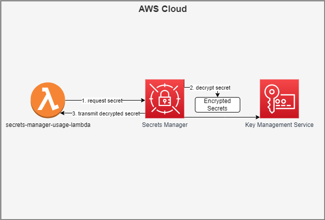

# secrets manager usage lambda
This lambda function is an example on how to retrieve a secret from AWS Secrets Manager via SDK

# High Level Architecture


# Install & Test & Zip:

## cd to secrets-manager-usage-lambda lambda folder
```
npm install
npm test
npm prune --production
zip -r secrets-manager-usage-lambda.zip *
```

# Deploy to AWS

## update code
```
aws lambda update-function-code --function-name secrets-manager-usage-lambda --zip-file fileb://secrets-manager-usage-lambda.zip
```
## update environment variable
```
 aws lambda update-function-configuration --function-name secrets-manager-usage-lambda --environment file://secrets-manager-usage-lambda.env.json
 ```

## invoke code
```
aws lambda invoke --function-name secrets-manager-usage-lambda --invocation-type Event --cli-binary-format raw-in-base64-out --payload file://resources/aws.input.json response.json

 ```
