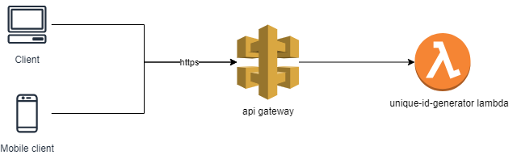

# unique id generator lambda
This lambda function receives requests from API Gateway and it return identifier value depending on incoming type and size query parameters

# High Level Architecture


# Install & Test & Zip:

## cd to unique-id-generator-lambda lambda folder
```
npm install
npm test
npm prune --production
zip -r unique-id-generator-lambda.zip *
```

# Deploy to AWS

## update code
```
aws lambda update-function-code --function-name unique-id-generator-lambda --zip-file fileb://unique-id-generator-lambda.zip
```
## update environment variable
```
 aws lambda update-function-configuration --function-name unique-id-generator-lambda --environment file://aws-lambda-example.env.json
 ```

## invoke code
```
aws lambda invoke --function-name unique-id-generator-lambda output.json
 ```

## example curl command & response
```
curl --location --request GET '<api_gateway_url>?type=ONLY_NUMBERS&size=5'

{
    "id": "48934"
}
 ```

## Valid Input Parameters
```
* Query parameters 
- type (string, mandatory)
- size (number, optional)

const UNIQUE_ID_TYPES = ['ONLY_NUMBERS', 'ONLY_CHARS', 'NUMBERS_AND_CHARS'];
const UNIQUE_ID_MIN_SIZE = 4;
const UNIQUE_ID_MAX_SIZE = 10;
const UNIQUE_ID_DEFAULT_SIZE = 8;
 ```